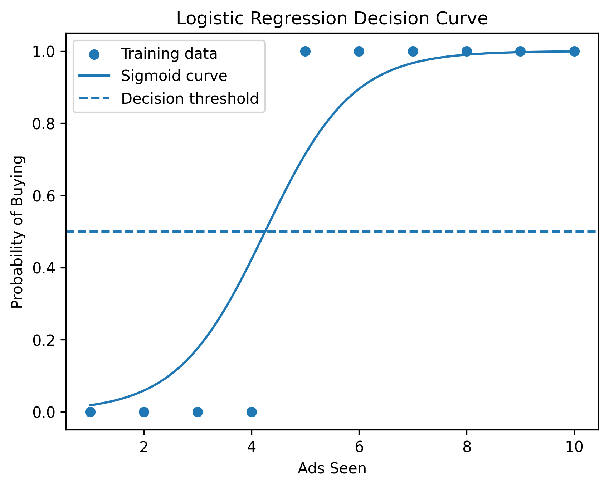
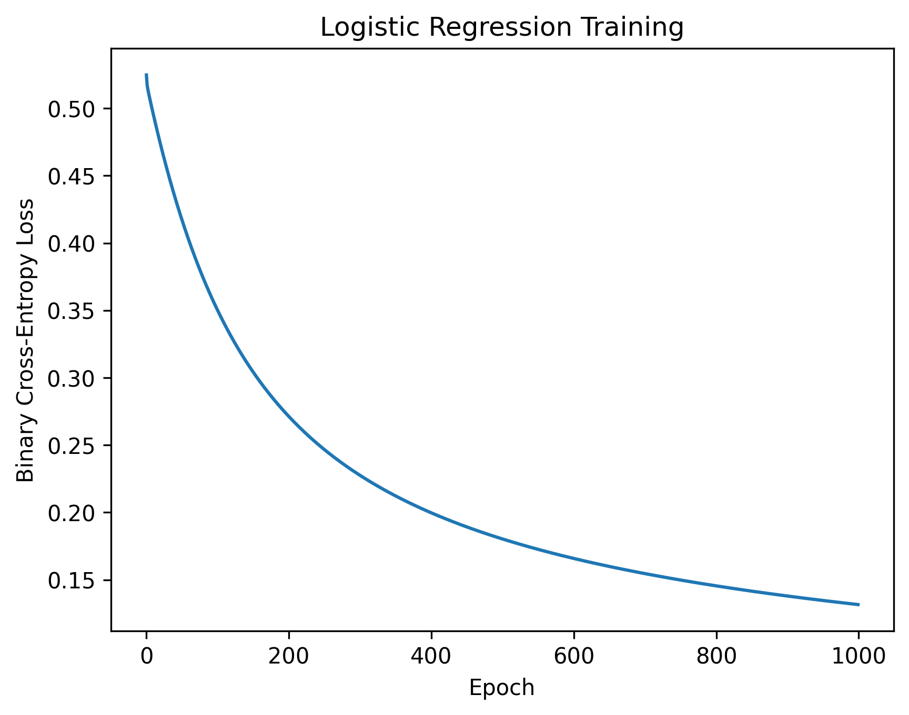

# Logistic Regression from Scratch

## Overview

This project implements logistic regression from scratch using NumPy and gradient descent, without using a machine learning library such as scikit-learn.

The implementation includes:

- Sigmoid activation function
- Binary cross-entropy loss
- Gradient descent optimization
- Probability prediction
- Binary classification using a decision threshold
- Training accuracy evaluation
- Predictions on new observations
- Visualization of the learned sigmoid curve
- Visualization of training loss convergence

## Objective

The goal of this project is to understand the mathematical and computational foundations of logistic regression by implementing the algorithm manually rather than relying on a pre-built machine learning model.

## Mathematical Background

### Logistic Model

Logistic regression models the probability of the positive class using the sigmoid function:

$$
P(y=1|x) = \sigma(z)
$$

where:

$$
z = \theta_0 + \theta_1x
$$

and the sigmoid function is:

$$
\sigma(z) = \frac{1}{1 + e^{-z}}
$$

### Binary Cross-Entropy Loss

The model is trained by minimizing binary cross-entropy loss:

$$
J(\theta) =
-\frac{1}{m}
\sum_{i=1}^{m}
\left[
y_i\log(\hat{y}_i)
+
(1-y_i)\log(1-\hat{y}_i)
\right]
$$

To improve numerical stability, predicted probabilities are clipped before applying the logarithm.

### Gradient Descent

The parameters are updated using:

$$
\theta := \theta - \alpha\nabla J(\theta)
$$

where:

- $\theta$ represents the model parameters
- $\alpha$ is the learning rate
- $\nabla J(\theta)$ is the gradient of the loss function

## Dataset

A small synthetic dataset was created to demonstrate binary classification.

The input represents the number of advertisements seen by a user, while the target represents whether the user makes a purchase.

| Ads Seen | Purchase |
|----------|----------|
| 1 | 0 |
| 2 | 0 |
| 3 | 0 |
| 4 | 0 |
| 5 | 1 |
| 6 | 1 |
| 7 | 1 |
| 8 | 1 |
| 9 | 1 |
| 10 | 1 |

The dataset is intentionally simple and is used primarily to demonstrate how logistic regression works.

## Training Configuration

The model was trained using:

- Learning rate: `0.1`
- Epochs: `1000`
- Initial parameters: zeros
- Classification threshold: `0.5`

## Results

The model successfully learned a sigmoid decision curve separating the two classes.

The final training results were approximately:

- Intercept: `-5.2301`
- Slope: `1.2292`
- Final binary cross-entropy loss: `0.1316`
- Training accuracy: `100%`

Because the dataset is small and synthetically constructed, the perfect training accuracy should not be interpreted as evidence of strong generalization.

### Logistic Regression Decision Curve



### Training Loss Convergence



## Example Predictions

The trained model was tested on new observations:

| Ads Seen | Probability of Buying | Prediction |
|----------|-----------------------|------------|
| 2 | 0.0589 | 0 |
| 4 | 0.4223 | 0 |
| 5 | 0.7142 | 1 |
| 7 | 0.9669 | 1 |
| 11 | ~0.9997 | 1 |

The model uses a probability threshold of `0.5` to convert predicted probabilities into binary class labels.

## Project Structure

```text
logistic-regression-from-scratch/
├── README.md
├── logistic_regression.py
├── requirements.txt
├── .gitignore
└── results/
    ├── logistic_curve.png
    └── loss_convergence.png
```

## How to Run

Clone the repository and install the required dependencies:

```bash
pip install -r requirements.txt
```

Run the program:

```bash
python3 logistic_regression.py
```

The program trains the logistic regression model, prints the training results and predictions, and generates the visualizations.

## What I Learned

Through this implementation, I learned:

- How logistic regression converts a linear combination of features into probabilities using the sigmoid function.
- How binary cross-entropy measures classification error.
- How gradients are calculated for logistic regression.
- How gradient descent optimizes model parameters.
- How probabilities can be converted into binary predictions using a decision threshold.
- How training loss can be monitored to evaluate optimization.
- How numerical stability can be improved when calculating logarithmic loss.

## Limitations

This implementation is intentionally simple and uses a small synthetic dataset. It does not currently include:
- Multiple input features
- Train/validation/test splits
- Feature scaling
- Regularization
- Precision, recall, or F1-score
- Comparison with a library implementation
- Evaluation on a real-world dataset

## Future Improvements

Possible extensions include:
- Extending the implementation to multiple features.
- Adding train/validation/test splits.
- Implementing regularization.
- Experimenting with different learning rates and decision thresholds.
- Evaluating the model using precision, recall, and F1-score.
- Testing the implementation on a real-world binary classification dataset.
- Comparing the implementation with scikit-learn's logistic regression.